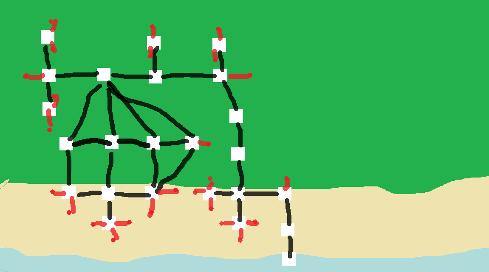

# The map

the white squares are the places you can move the black lines is path to get to 
each square and the read are paths that kill you note some paths kill you for trying to move backwords
and other times baclwords isn't a choice and the path is only their for moving forward

---

# Results of Testing

The test results show the actual outcome of the testing, following the [Test Plan](test-plan.md)

---

## Gameplay

teasting if the game works 

### Test Data Used

playing the game my self once diying once winning both should have the same outcome 

### Test Result

it worked just as I though it would I was able to die and win and playagain and didn't get stuck anywhere

---

## testing boards

im going to go to each sides of the map and try see what happens

### Test Data Used

moving around to where the edges are and try to excape the map 

### Test Result

[View video here](screenshots/testingmoving.mp4)

 as you can see everytime I got to a certant point it stop letting me move in that direction or it killed / reset me 

---

---

## the map - Invalid movement

teasting that the user can't move outside the map or in any odd ways that doesn't work with the map

### Test Data Used

I will just be moving around looking for movments that seam out of place 

### Test Result

[View video here](screenshots/testingmoving.mp4)

some of the movment is a little odd when I go right after going backwords at the start and then go right again to get back 
to where I was When I went backwords is odd and so is having a fox kill you on the left side in sted of somthing more fitting
like a seagul or it could take you back to the nest.

### fixed the starting spaces (the others don't need fixing)

what I have done is remove the fox that shouldent be their and then had it loop with some of the beach entrances
giving more ways to move of the beach without dying / killing the player.

------

